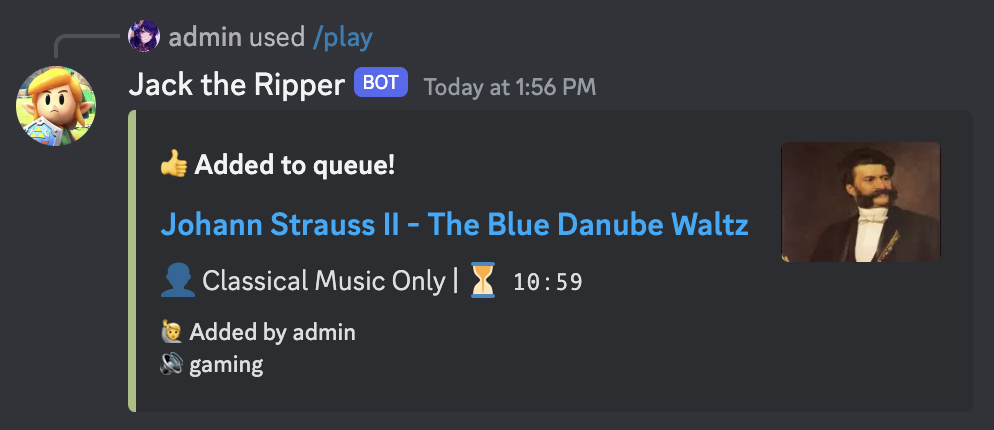
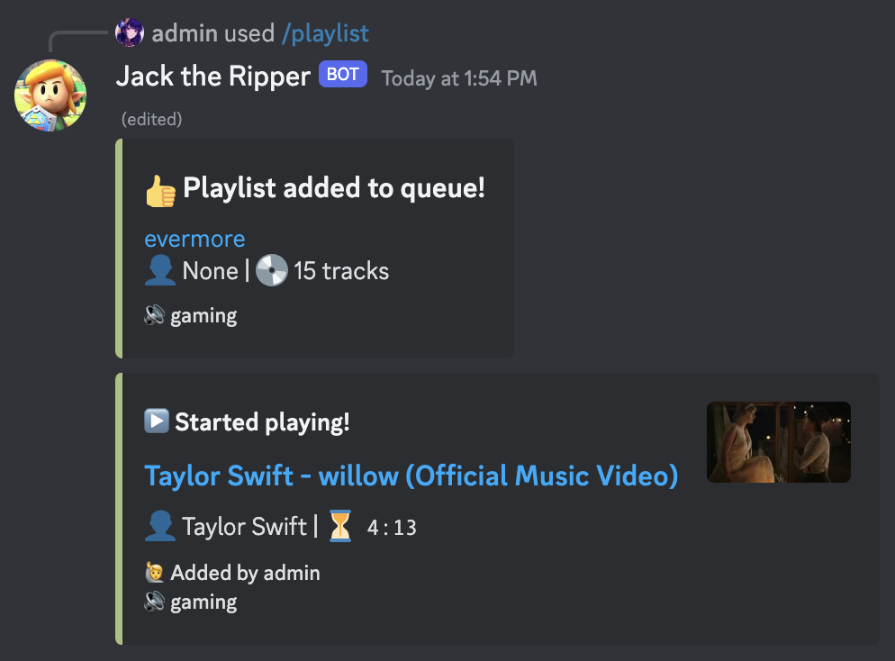

# Jack the Ripper

A simple music bot that streams from YouTube and supports slash commands! 🐈‍⬛

Try it on our [Discord server](https://discord.gg/RNmMMF6xHY)!

<br>


## 💠 Table of contents
- [🗡️ Features](#🗡️-features)
- [🖥️ Usage](#🖥️-usage)
- [🤨 Issues](#🤨-issues)
- 👩‍💻 [Contributing](#👩‍💻-contributing)

## 🗡️ Features
📺 Supports playing from YouTube!

- 🔗 Using [video/playlist URL](https://youtu.be/FXsGCieXm1E)

- 🔍 Searching by keyword

💻 Uses slash commands!

▶️ Playback controls 

📃 Powerful queue controls (remove, swap, move, etc)

## 🖥️ Usage

### 📦 Dependencies

You need the following packages:

- [discord.py](https://github.com/Rapptz/discord.py)
- [yt-dlp](https://github.com/yt-dlp/yt-dlp)
- [PyNaCl](https://pypi.org/project/PyNaCl/)
- [python-dotenv](https://pypi.org/project/python-dotenv/) (NOT `dotenv`)

Instructions to install them can be found below.

You also need to have [ffmpeg](https://ffmpeg.org/) installed.

### 🌐 Download the bot

1. Clone this repository:

```
git clone https://github.com/succsuccsucc/jack-the-ripper.git
```

2. Set up a virtual environment for the bot:
```
cd ~/jack-the-ripper
python -m venv ./.venv
```

3. Install the dependencies
```
pip install -r requirements.txt
```

### 🪪 Get an account for the bot

1. Create a bot user in the [Discord Developer Portal](https://discord.com/developers/applications) and copy its token.

    > [Here](https://realpython.com/how-to-make-a-discord-bot-python/#how-to-make-a-discord-bot-in-the-developer-portal) is a tutorial on how to create a bot on Discord.

2. Create a file named `.env` in the bot's directory with the following contents:

```
# .env
DISCORD_TOKEN=<your-bot-token>
ADMIN_ID=<your-discord-id>
TEST_SERVER_ID=<your-test-server-id>
```

Where `ADMIN_ID` is your Discord ID, and `TEST_SERVER_ID` is the ID of a server that only has you in it.
  > Find your user and server IDs [here](https://support.discord.com/hc/en-us/articles/206346498-Where-can-I-find-my-User-Server-Message-ID).

### 🏃‍♀️ Run the bot

1. Run `bot.py`

```
python3 botv2.py
```

### 🏁 And you're all set!

## 🤨 Issues

### 📑 Known issues

### 📮 Report a problem

If you encounter any issue with Jack the Ripper, open an issue on this repository or report it on our [Discord server](https://discord.gg/RNmMMF6xHY)!

## 👩‍💻 Contributing

Contributions are welcome! Open a pull request on this repository.